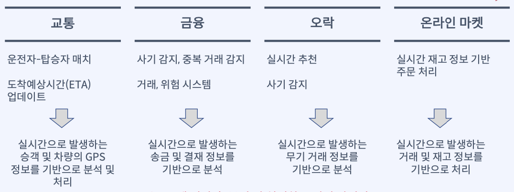
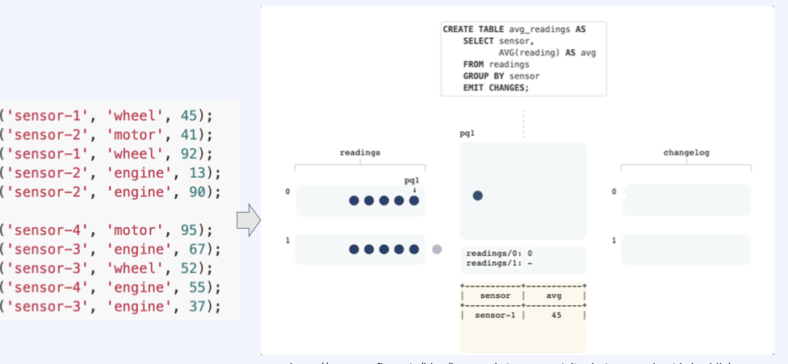
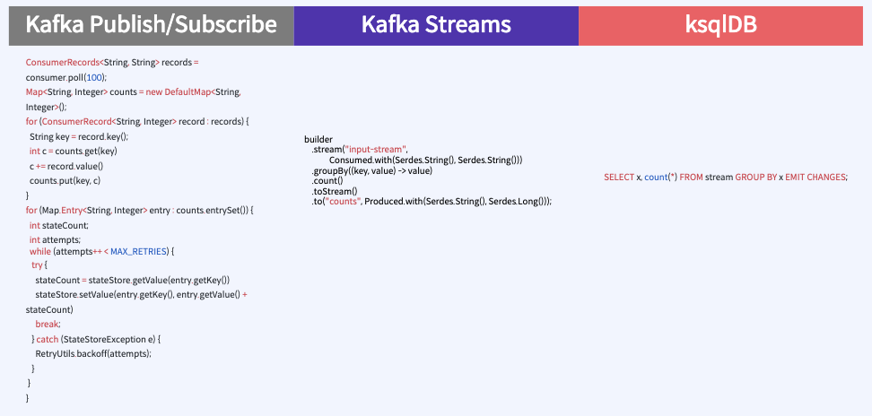
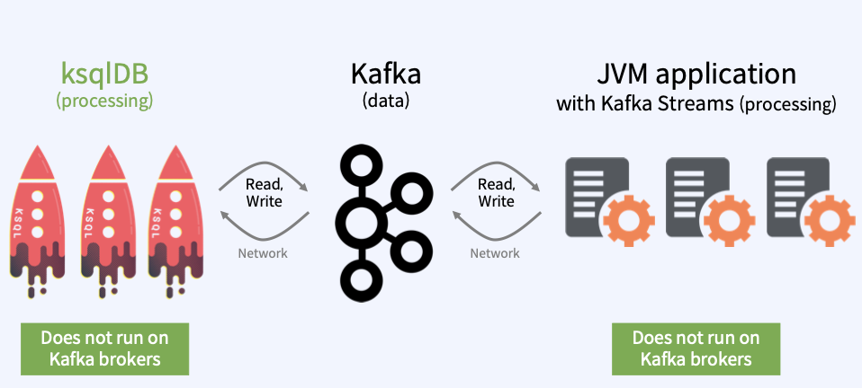
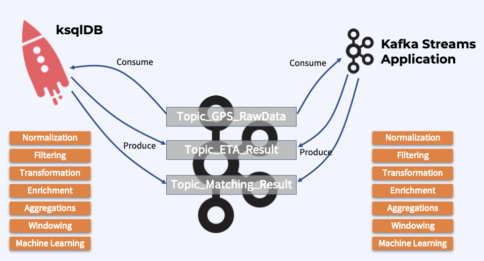

1. Realtime Event Stream Processing
    * 실시간 이벤트 스트림 데이터 분석 및 처리
    * 
    * 위 이미지를 통해 구하는 데이터는 적재된 데이터를 분석 및 처리하는 거시 아니라 실시간으로 처리하는게 핵심이다. Kafka를 활용해 움직이는 데이터(Data in Motion)를 분석 및 처리하는 것이 가능하다.
    * 
    * 위 이미지는 topic의 event를 ksql을 통해 실시간 데이터를 분석하는 예시를 보여 준다.

2. 기존에 사용하던 Realtime Event Stream Processing 방법들
    * Apache Spark
        - 범용적인 목적을 지닌 분산 클러스터 커퓨팅 프레임워크
        - MapReduce 형태의 클러스터 컴퓨팅 패러다임의 한계를 극복하고자 등장
        - Spark Cluster를 구성해야 하며 이를 관리하는 Cluster Manager와 데이터를 분산 저장하는 Distributed Storage System이 필요 - 사용이 어려움
    * Apache Storm
        - 주로 Clojure 프로그래밍 언어로 작성된 분산형 스트림 프로세싱 프레임워크
        - 별도의 Storm Cluster를 설치 구성
        - 상태 관리가 지원되지 않아 Aggregation, Windows, Water Mark 등을 사용할 수 없기에 고급 분석에 제약
    * Apache Flink
        - 통합 스트림 처리 및 Batch 처리 프레임워크
        - Java 및 Scala로 작성된 분산 스트리밍 Data Flow 엔진
        - 사용자의 Stream Processing Code는 Flink Cluster에서 하나의 Job으로 배포 및 샐행
    * 여기있는 방법들은 대부분 Framework를 사용하고 Cluster 구축 진입 장벽이 높다.

3. Kafka 진영에서 나온 Realtime Event Stream Processing 방법
    * Kafka Streams
        - Event Streaming용 Library(Java, Scala)
        - Kafka 0.10.0.0에 처음 포함
        - Framework 아니고 별도의 Cluster 구축이 불필요
        - application.id로 KStreams Application을 grouping
        - groupBy, count, filter, join, aggregate 등 손쉬운 스트림 프로세싱 api 제공
    * ksqlDB
        - Event Streaming Database(또는 SQL 엔진) - RDBMS/NoSQL DB가 아님
        - Confluent Community Livense를 사용하면 사용 가능
        - 간단한 Cluster 구축 방법 - 동일한 ksql.service.id로 ksqlDB를 여러 개 기동
        - 여러 개의 Cluster는 ksql.service.id 값을 서로 다르게 하기만 하면 됨
        - SQL과 유사한 형태로 ksqlDB에 명령어를 전송하여 스트림 프로세싱 수행

4. Pub/Sub vs Streams vs ksqlDB 비교
    * 

5. ksqlDB vs Streams
    * 두개의 차이는 sql개발을 할지 혹은 Java Application을 개발할지 정해야 한다.
    * 둘다 Broker와 별도로 구성이 된다.
    * 
    * 
    * ksql은 confluent에서 query를 작성해 실시간 확인이 가능하고 stream은 java와 scala로 code를 작성하고 실행 및 테스트를 해야 한다.