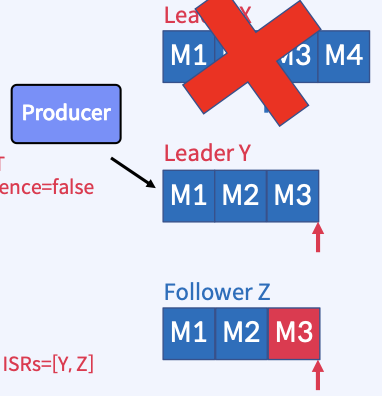

1. Producer Acks
    * Producer Paramter 중 하나로 Producer가 message를 보내고 broker 들이 복제에 시에 몇개의 rf까지 성공 했을때 broker가 producer에 성공했다고 회신 주는 옵션
    * acks=0
        - ack가 필요없음, 자주 사용되지 않고 message 손실이 있더라도 빠르게 보내는 경우 사용
    * acks=1
        - default로 Leader가 메시지를 수신하면 ack를 보냄
        - Leader가 ack를 보내고 장애가 나면 message 손실 발생
        - At most once(최대 한 번) 보장
    * acks=-1 or acks=all
        - Leader가 모든 Replica까지 Commit 되면 ack를 보냄
        - Leader를 잃어도 데이터가 살아남을 수 있도록 보장
        - 대기 시간이 길고 특정 실패사례에서 반복되는 데이터 발생 가능성 있음
        - At least once(최소 한 번) 보장

2. Producer Retry
    * 네트워크 또는 시스템의 일시적인 오류를 보완하기 위해 모든 환경에서 중요
    * param
        - retries
            message를 send하기 위해 재시도하는 횟수
            MAX_INT
        - retry.backoff.ms
            재시도 사이에 추가되는 대기 시간
            100
        - request.timeout.ms
            Producer가 응답을 기다리는 최대 시간
            30,000
        - delivery.timeout.ms
            send 후 성공 또는 실패를 보고하는 시간의 상한
            120,000
    * acks=0인 경우 retry는 무의미
    * retries를 조정하기보다는 delivery.timeout.ms 조정으로 재시도 동작을 제어

3. Producer Batch 처리
    * RPC수를 줄여서 Broker가 처리하는 작업이 줄어들기 때문에 더 나은 처리량 제공
    * 
    * linger.ms
        - message가 함께 Batch 처리될 때까지 대기 시간
        - default 0으로 즉시 보낸다.
    * batch.size
        - 보내기 전 Batch의 최대 크기
        - default 16KB
    * Batch 처리의 일반적인 설정은 linger.ms=100 및 batch.size=1000000
        - batch.size가 너무 크면 모두 체울떄 까지 send를 못하는 경우도 있으니 linger.ms도 잘 설정 해야한다.

4. Producer Delivery Timeout
    * 
    
5. Message Send 순서 보장
    * 진행 중(in-flight)인 여러 요청을 재시도하면 순서가 변경될 수 있다.
    * 이를 보장하기 위해서는 enable.idempotence=true로 해야 한다.
    * 
    * max.in.flight.requests.per.connection=5(default)로 세팅되면 producer가 한 번 요청에 최대 5개의 batch를 보낼 수 있다.
    * batch 0, 1, 2, 3, 4, 5개를 보내다가 0번이 실패하면 1, 2, 3, 4는 commit log에 기록되고 retry를 통해 0번이 저장된다. 이러면 순서 보장이 안된다.
    * enable.idempotence를 사용하면 하나의 batch 실패하면 다른 batch도 OutOfOrderSequenceException을 내며 retry를 시도하게 한다.

6. Page Cache와 Flush
    * message는 Partition에 기록됨
    * Partition은 Log Segment file로 구성(default 1GB마다 새로운 Segment 생성)
    * 성능을 위해 Log Segment는 OS Page Cache에 기록
    * 로그 파일에 저장된 메시지의 데이터 형식은 Broker가 Producer로 부터 수신선 것, 그리고 Consumer에게 보내는 것과 동일하므로 Zero-Copy가능
        - Zero-Copy는 전송한 데이터가 User Space에 복사되지 않고 CPU 개입 없이 Page Cache와 Network Buffer 사이에서 직접 전송되는 것을 의미 Broker Heap 를 절약하고 엄청난 처리량 제공
    * Page Cache는 다음과 같은 경우 디스크로 Flush됨
        - Broker가 완전히 종료
        - OS background "Flusher Thread" 실행
    * 

7. Flush 되기 전에 Broker 장애가 발생하면?
    * Partition이 Replication되어 있다면, Broker가 다시 온라인 상태가 되면 필요시 Leader Replica에서 데이터가 복구됨
    * Replication이 없다면 데이터는 영구적으로 손실될 수 있음

8. Kafka 자체 Flush 정책
    * 마지막 Flush 이후의 메시지수 또는 시간으로 Flush를 트리거하도록 설정 가능
    * 요런 설정은 기본으로 유지하는 것을 권장

9. In-Sync Replicas 리스트 관리
    * message가 ISR 리스트의 모든 Replica에서 수신되면 Commit된 것으로 간주 Kafka Cluster의 Controller가 모니터링하는 Zookeeper의 ISR 리스트에 대한 변경 사항은 Leader가 유지 n개의 Replica가 있는 경우 n-1개의 장애를 허용할 수 있음 !!! 물론 다른 옵션에 따라 달라질 수 있음
    * Follower가 실패하는 경우
        - Leader에 의해 ISR 리스트에서 삭제됨
        - Leader는 새로운 ISR을 사용하여 Commit함
        * 
    * Leader가 실패하는 경우
        - Controller는 Follower 중에서 새로운 Leader를 선출
        - Controller는 새 Leader와 ISR 정보를 먼저 Zookeeper에 Push한 다음 로컬 캐싱을 위해 Broker에 Push함
        * 
        - Partition에 Leader가 없으면 Leader가 선출될 때까지 해당 Partition을 사용할 수 없음
        - Producer의 send는 retries 파라미터가 설정되어 있으면 재시도하고 응답이 없으면 NetworkException을 발생

10. Replica Recovery
    * acks=all
        - 3개의 Replica로 구성된 하나의 Partition
        - Producer가 4개의 메시지를 보냄(m1, m2, m3, m4)
        - 이떄 acks=all이고 retries=MAX_INT, enable.idempotence=false이다.
        * 
        - 이미지를 보면 M1, M2까지 ISR에 있는 broker는 모두 복제했고 commit까지 했다.
        * 
        - LeaderX가 장애가 나면 새로운 Leader가 선출됨
        - Controller가 FollowerY를 Leader로 선출
        - Leader Epoch가 1로 증가
        - Follower Z는 Leader Y를 통해 복제
        * 
        - Broker X는 M3, M4에 대한 ack를 Producer에게 보내지 못했기에 Producer는 재시도한다.(m3, m4)
        - idempotence=false이므로 M3는 중복 발생
        - Follower Z는 Leader Y를 Fetch하기에 중복 message 저장
        * 
        - 다시 Leader X가 복구가 되면 Zookeeper에 연결하고 Controller 부터 metadata를 받는다. 
        - Leader Y로 부터 Leader Epoch을 fetch하고 Leadership이 변경된 시점부터 Truncate 한다.(m3, m4)
        - Leader X는 Follower X로 되고 Leader Y로 부터 fetch를 한다.
    * acks=1
        - Leader X는 m4까지 받고 ack를 producer에게 보냈으므로 Broker들은 m4를 완전 유실하게 된다.
        * 

11. Availability와 Durability
    * 우리는 가용성과 내구성 중 선택을 해야 한다.
    * Topic 파라미터 - unclean.leader.election.enable
        - ISR 리스트에 없는 Replica를 Leader로 선출할 것인지에 대한 옵션으로 default=false
        - ISR에 broker가 없으면 서비스 중단을 하게 된다.
        - true로 하게 되면 데이터는 완전 유실된다.
    * Topic 파라미터 - min.insync.replicas
        - 최소 요구되는 ISR의 개수 옵션 default=1
        - ISR에 broker가 min.insync.replicas 보다 적으면 NotEnoughReplicas 예외 발생
        - 보통 acks=all + min.insync.replicas=2로 사용한다.
        - 이런 경우 우리가 위에서 배운 n-1이 아닌 n-2의 장애를 커바할 수 있다.

12. Partition Assignment
    * Partition을 Consumer에게 Assign 할때
        - 하나의 Partition은 지정된 Consumer Group내의 하나의 Consumer 만 사용
        - 동일한 key를 가진 message는 동일한 Consumer가 사용(Partition 수를 변경하지 않는 한)
        - Consumer의 설정 파라미터 중에 partition.assignment.strategy로 할당 방식 조정
        - Consumer Group은 Group Coordinator라는 프로세스에 의해 관리됨

13. Consumer Group Coordination
    * Group Coordinator(하나의 broker)와 Group Leader(하나의 consumer)가 상호작용
    * __consumer_offsets는 internal Topic에 저장되고 __consumer_offsets Topic의 Partition 개수는 default 50
    * hash(group.id) % offsets.topic.num.partitions 의 값으로 group.id가 저장될 __consumer_offsets의 Partition(그러면 자동으로 이 Partition을 가진 Broker가 coordinator)을 결정
    * 
        1. Consumer는 동일한 group.id로 Kafka Cluster에 자신을 등록
            - JoinGroup을 하는동안 group.initial.rebalance.delay.ms(default 3초)를 대기
        2. 알고리즘을 통해 Group Coordinator 선택
        3. Group Coordinator는 다시 group leader를 선출하는데 joinGroup시에 가장 먼저 들어온 consumer가 된다.
        4. Group Coordinator는 group leader에게 joinGroup 순서의 목록을 준다.
        5. group leader는 순서 목록으로 partition을 분배한다.
            - 이때 partition.assignment.strategy를 사용
            - Consumer보다 Partition이 많은 경우 consumer에게 여러 partition할당
            - Consumer가 Partition보다 많으면 남은 Consumer는 idle이 된다.
        6. group leader는 분배 목록을 다시 Group Coordinator에게 전달
            - group coordinator는 분배 목록을 메모리에 캐시하고 Zookeeper에 유지
        7. group coordinator는 확인차 Consumer Group에 확인 신호르 보냄

14. Group Coordinator는 Partition을 할당하지 않는다. client에게 이를 위임한다.
    * Broker의 부담을 주리기 위해

15. Consumer Rebalancing Trigger
    * consumer가 consumer group에서 탈퇴
    * 신규 consumer가 consumer group에 합류
    * consumer가 Topic 구독을 변경
    * Consumer Group은 Topic 메타데이터의 변경 사항을 인지(ex: partition 증가)

16. Rebalancing Process
    * Group Coordinator는 heartbeats의 플래그를 사용하여 consumer에게 rebalance 신호를 보냄
    * consumer가 일시 중지하고 offset을 commit
    * consumer는 consumer group의 새로운 generation에 다시 합류
    * Partition 재할당
    * Consumer는 새 Partition에서 다시 consume을 시작
    * ! Consumer Rebalancing시 Consumer들은 메시지를 Consume하지 못함 따라서, 불필요한 Rebalancing은 반드시 피해야 함

17. Consumer Heartbeats
    * 장애를 인지하기 위함
    * consumer의 poll과는 별도의 thread로 heartbeats를 보냄
        - heartbeat.interval.ms default 3초
    * heartbeats가 수신되지 않으면 consumer는 consumer group에서 제거
        - session.timeout.ms default 10초
    * poll은 heartbeats와 상관없이 주기적으로 호출되어야 함
        - max.poll.interval.ms default 5분

18. 과도한 Rebalancing을 피하는 방법
    * 성능 최적화에 필수
    * Consumer Group 멤버 고정
        - group의 각 consumer에게 고유한 group.instance.id를 할당
        - rejoin은 알려진 group.instance.id에 대한 rebalance를 trigger하지 않음
        - consumer는 LeaveGroupRequest를 사용하지 않아야 함(group.instance.id이게 있어도 rebalance 됨)
    * session.timeout.ms
        - hearbeat.interval.ms를 session.timeout.ms의 1/3으로 설정
        - session.timeout.ms는 group.min.session.timeout.ms(default 6sec)와 group.max.session.timeout.ms(default 5min)의 사이값
        - 장점: consumer가 rejoin할 수 있는 더 많은 시간을 제공
        - 단점: consumer 장애를 감지하는데 시간이 더 오래 걸림
    * max.poll.interval.ms
        - consumer에게 poll한 데이터를 처리할 수 있는 충분한 시간 제공
        - 너무 크게 하면 안됨

19. Partition Assignment Strategy
    * Consumer 설정 파라미터 중에서 partition.assignment.strategy로 할당 조절
    * RangeAssignor
        - Topic 별로 작동하는 Default Assignor
    * RoundRobinAssignor
        - Round Robin 방식으로 Consumer에게 Partition을 할당
    * StickyAssignor
        - 최대한 많은 기존 Partition 할당을 유지하면서 최대 균형을 이루는 할당을 보장
    * CooperativeStickAssignor
        - 동일한 StickyAssignor 논리를 따르지만 협력적인 Rebalance를 허용
    * ConsumerPartitionAssignor
        - 인터페이스를 구현해 사용자 지정 할당 전략을 사용

20. Range Assignor
    * partition.assignment.strategy 파람의 default assignor
    * Topic을 기준으로 동일하게 consummer가 가져갈 수 있게 분배
    * Topic당 분배가 끝나면 다시 처음 consumer 부터 한다.
    * 만약 홀수개의 partition인 경우 앞쪽의 consumer에 partition을 할당 한다.
    * 

21. Round Robin Assignor
    * Range 방식 보다 효율적으로 분해
    * Reassign 후 Consumer가 동일한 Partition을 유지한다고 보장하지 않음
    * 
    * Consumer간 Subscribe 해오는 Topic이 다른 경우 할당 불균형이 발생할 가능성 있음
        - 3개의 Consumer와 Topic rkwjd
        - T0은 partition 1개, T1은 Partition 2개, T2는 Partition 3개 를 가정
        - C0은 T0만, C1은 T0, T1만, C2는 T0, T1, T2를 subscribe 한다.
        - 이런 경우 C2에 과도하게 트래픽이 몰린다.
        * 

22. Sticky Assignor
    * Round Robin 방식 보다 Rebalancing 오버헤드를 줄임
        * 
        - Round Robin 처럼 순서대로 partition을 consumer에 할당 한다.
        - 이때 Consumer1이 제거 되고 재할당이 발생하는 가정을 한다.
        * 
        - Round Robin은 전체를 다시 할당한다.
        - Sticky는 Consumer0, 2는 그대로 두고 Consumer1이 할당 했던 Partition만 다시 Consumer0, 2에 할당 한다.
    * 가능한 균형적으로 할당을 보장
        - consumer들에게 할당된 Topic Partition의 수는 최대 1만큼 다름
        - 시나리오
            1. 3개의 Consumer, Toptic이 있음
            2. Consumer 0은 T0만, Consumer 1은 T0, T1만 Cosumer 2는 T0, T1, T3을 subscribe한다.
            3. Round Robin의 경우 T1-P1이 Consumer 2로 할당이 되지만 Sticky는 특정 Consumer가 다른 Consumer들에 비해 2개 이상 더 적은 Topic Partition이 할당된 경우 Partition을 많이 가지고 있는 Consumer에 할 당 될 수 없다.
            * 
            - 위 이미지에서 보면 T1-P1은 Consumer 2에 할당하지 않고 Consumer 1에 할당 된다.
            * 
            - 위 이미지는 Consumer 0이 제거되어 재할당 되는 경우
    * 재할당이 발생했을 때 기존 할당을 최대한 많이 보존하여 유지
        - Topic Partition이 하나의 Consumer에서 다른 Consumer로 이동할 때의 오버헤드를 줄임

23. Consumer Rebalancing Process
    * 시간 흐름에 따른 Consumer Rebalance 과정
    * 
        1. Consumer a, b, c는 joinGroup을 Group Coordinator에 보내고 Rebalance을 한다.
        2. Group Coordinator는 Consumer a, b, c에 sync를 보내고 가장 먼저 joinGroup한 Consumer에게 Group Leader로 정하고 Consumer 리스트를 보낸다.
        3. Consumer 들은 sync를 다시 Group Coordinator에 보낸다. 그 중 Group Leader는 consumer 목록에서 맵핑된 partition 목록을 Group Coordinator에 보낸다.
        4. Broker는 SyncGroup 응답에서 Consumer 별 Partition 할당을 보낸다.

24. Eager Rebalancing 프로토콜
    * 최대한 단순하게 유지하는 방식
    * 
        1. Consumer a, b만 있다가 c가 joinGroup 요청
        2. 모든 Consumer들은 Partition을 revoked 
        3. Group Coordinator는 Consumer에서 sync를 보내고 Group Leader를 선출하고 consumer 목록을 주고 Group Leader는 consumer에 partition을 할당하고 해당 목록을 다시 Group Coordinator에 보낸다. 
        4. Group Coordinator는 Consumer와 sync한다.
    * 여기서는 모든 partition을 revoke하는 큰단점이 있다 필요한 partition만 revoke 할 수 는 없을까 해서 나온데 incremental coordinator rebalancing protocal!

25. Incremental Cooperative Rebalancing Protocal
    * 전체 재조정 동안 모두 정지 상태로 있는 대신 조정이 필요한 Consumer 의 Partition만 revoke 후 재조정 한다.
    * 해당 방식은 Apache Kafka2.5에 추가 되었다.

26. Cooperative Sticky Assignor
    * 두번의 Rebalancce으로 재조정이 필요한 부분만 조정 한다.
    * 
        1. Consumer c가 joinGroup 요청
        2. 모든 Partition을 revoke하지 않음
        3. Group Coordinator와 group을 sync 한다.
        4. sync하면서 revoke할 partition을 Consumer에게 전달
        5. Group Leader는 소유권을 이전하는 Partition들만 취소
        6. Partition을 취소한 구성원은 그룹에 Rejoin하여 취소된 Partition을 할당할 수 있도록 두 번째 재조정을 트리거 한다.
        7. 다시 joinGroup, sync 등이 일어나면서 Partition을 재할당 한다.

27. Kafka Log Segment File Directory
    * 각 Broker의 log.dirs 파라미터로 정의
    * Kafka Log Sefment File은 Data File이라고 부르기도 함
    * Segment File은 각 Broker의 server.properties 파일 안에 log.dirs 파라미터로 정의(comma로 구분해서 디엑토리 저정 가능)
    * 각 Topic과 그 Partition은 log.dirs 아래에 하위 디렉토리로 구성
    * 예로 test_topic의 Partition 0은 /data/kafka/kafka-log-a/test_topic-0로 생성
    * 

28. Partition 디렉토리 안의 Log File
    * 파일 명에 의마가 있다.
    * 
    * 파일 명은 offset을 가리킨다.

29. Partition 디렉토리에 생성되는 파일들의 타입
    * Log Segment File - 메시지와 metadata 저장 - .log
    * Index File - 각 메시지의 Offset을 Log Segment 파일의 Byte 위치에 매핑 - .index
    * Time-based index File - 각 메시지의 timestamp를 기반으로 메시지를 검색하는 데 사용 - .timeindex
    * Leader Epoch Checkpoint File - Leader Epoch과 관련 Offset 정보를 저장 - leader-epoch-checkpoint
    * idempotent Producer를 사용하면 - .snapshot
    * Transactional Producer를 사용하면 - .txnindex

30. Log Segment File Rolling
    * 파라미터 중 하나라도 해당되면 새로운 Segment File로 rolling
        - log.segment.bytes(default 1gb)
        - log.roll.ms(default 168 hour)
        - log.index.size.max.bytes(default 10mb)

    * __consumer_offset(Offset Topic)의 Segment File Rolling 파라미터는 별도
        - offsets.topic.segment.bytes(default 100mb)

31. Checkpint File
    * Broker에는 2 개의 Checkpint File이 존재
        - log.dirs 디렉토리에 위치
        - replication-offset-checkpoint
            마지막으로 Commit된 메시지의 ID인 High Water Mark
            시작시 Follower가 이를 사용하여 Commit되지 않은 메시지를 Truncate
        - recovery-point-offset-checkpoint
            데이터가 디스크로 Flush된 지점
            복구 중 Broker는 이 시점 이후의 메서지가 손실되었는지 여부를 확인

32. Delivery Semantics
    * At-Most-Once
        - 확인 시간이 초과되거나 오류가 반환될 때 Producer가 재시도 하지 않으면, 메시자가 kafka Topic에 기록되지 않아 Consumer 에게 전달되지 않을 수 있음
        - 중복 가능성을 피하기 위해 때때로 메시지가 전달되지 않을 수 있음을 허용
    * At-Least-Once
        - Producer가 Kafka Broker 로 부터 ack를 수신하고 acks=all 이면 메시지가 Kafka Topic에 최소 한 번 작성되었음을 의미
        - 그러나 ack가 시간 초과되거나 오류를 수신하면 메시지가 Kafka Topic에 기록되지 않았다고 가정하고 메시지 전송을 다시 시도할 수 있음
        - Broker가 ack를 보내기 직전에 실패했지만 메시지가 Kafka Topic에 성공적으로 기록된 후에 재시도를 수행하면 메시지가 두번 기록되어 최종 Consumer에게 두 번 이상 전달되어 중복 작업과 같은 잘못된 결과로 이어질 수 있음
    * Exactly-Once
        - Producer가 메시지 전송을 다시 시도하더라도 메시지가 최종 Broker에게 정확히 한 번 전달됨
        - 메시징 시스템 자체와 메시지를 생성하고 소비하는 애플리케이션 간의 협력이 방드시 필요함
        - 예시로 메시지를 성공적으로 사용한 후 Kafka Consumer를 이전 Offset으로 되감으면 해당 Offset에서 최신 Offset까지 모든 메시지를 다시 수신하게 됨

33. Exactly Once(EOS)의 필요성
    * 중복 메시지로 인한 중복 처리 방지
    * client에서 생성되는 중복 메시지 방지
    * Transaction 기능을 사용하여, 하나의 트랜잭션내의 모든 메시지가 모두 Write 되었는지 또는 전혀 Write 되지 않았는지 확인(Atomic Message)
    * Apache Kafka 0.11.0, Confluent Platform 3.3 이전은 At-Least-Once를 하고 Consumer에서 중복을 제거
    * Java Client에서만 지원
        - Producer, Consumer
        - Kafka Connect(지원 하는 것을 잘 확인해야 함)
        - Kafka Streams Api
        - Confluent Rest Proxy
        - Confluent ksqlDB
    * Transaction Coordinator 사용
        - 특별한 Transaction Log를 관리하는 Broker Thread
        - 일련의 ID 번호(Producer ID, Sequence Number, Transaction ID)를 할당하고 client가 이 정보를 메시지 Header에 포함하여 메시지를 고유하게 식별
        - Sequence Number는 Broker가 중복된 메시지를 skip할 수 있게 함

34. Exactly Once 관련 파라미터
    * Idempotent Producer
        - Producer의 파라미터 enable.idempotence=true
        - Producer가 retry해도 중복 방지
        - 성능에 영향 별로 없음
    * Transaction
        - 각 Producer에 고유한 transactional.id를 설정
        - Producer를 Transaction Api를 사용하여 개발
        - Consumer에서 isolation.level을 read_committed로 설정
        - Broker의 파라미터는 Transaction을 위한 Default 값이 적용 되어 있음

35. Idempotent Producer 메시지 전송 프로세스
    * 
    * 
    * 
    * 
    * 
