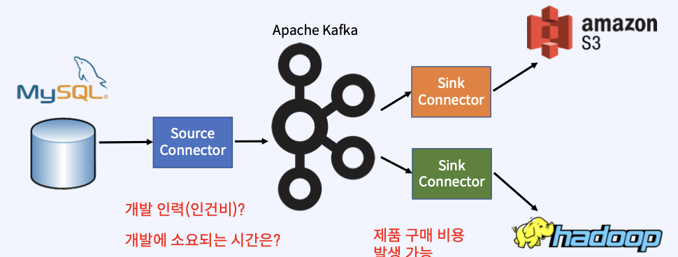
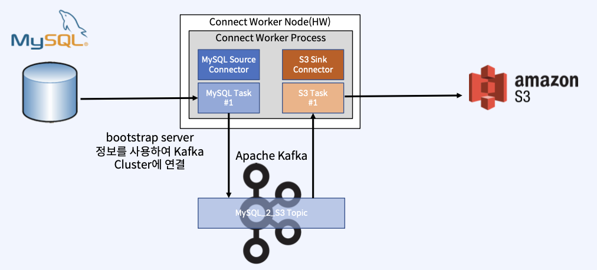
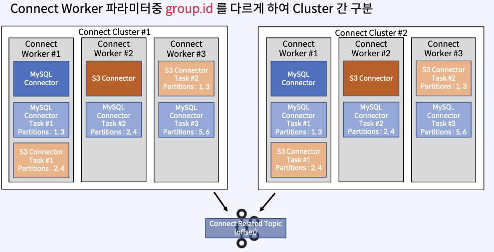

1. System 간 메시지 전송
    * System 간 메시지 전송이 필요할 때만 Application(Producer, Consumer)를 개발할 필요는 없다.
    * Kafka Connector로 손쉽게 구성할 수 있다.
    * 
    * Source Connector
        - 원본 데이터를 Kafka로 보내는 Connector
    * Sink Connector
        - Kafkad의 데이터를 다른 infra로 보내는 Connector

2. 용어정리
    * Kafka Connect
        - Kafka 안팎으로 데이터를 스트리밍하기 위한 Framework
    * Connectors
        - Task를 관리하여 데이터 스트리밍을 조정하는 Plugin(jar), Java Class/Instance
    * Tasks
        - Kafka에서 또는 Kafka에서 데이터를 전송하는 방법의 구현체(Java Class/Instance)
    * Workers
        - Connector 및 Task를 실행하는 실행 중인 프로세스
    * Converters
        - Connect와 데이터를 보내거나 받는 시스템 간에 데이터를 변환하는 데 사용되는 Components(Java Class)
    * Transforms
        - Connector에 의해 생성되거나 Connector로 전송되는 각 메시지를 변경하는 간단한 Components(Java Class)
    * Dead Letter Queue
        - Connect에서 Connector 오류를 처리하는 방법

3. Connect Architecture
    * 
    * Connect와 Kafka의 연결도 bootstrap server 정보를 이용

4. Standalone vs Distributed Workers
    * 
    * 

5. Connect Worker 배포/구동
    * 배포전에는 Connect Worker Process만 존재
    * Connector, worker를 사용하기 위해 Configuration을 세팅
    * 
