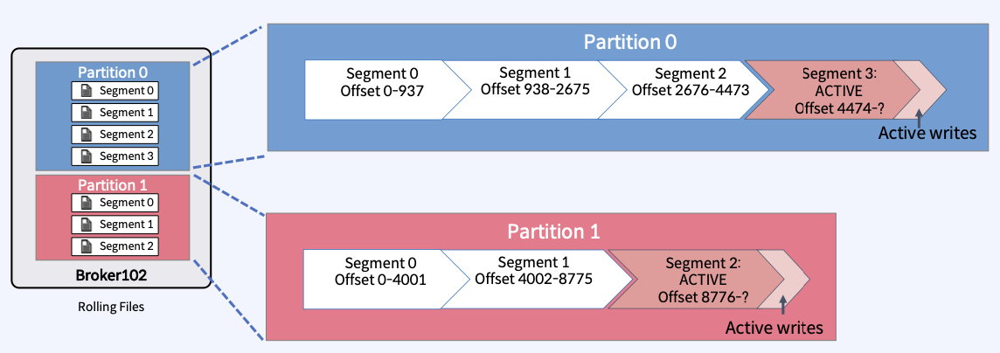
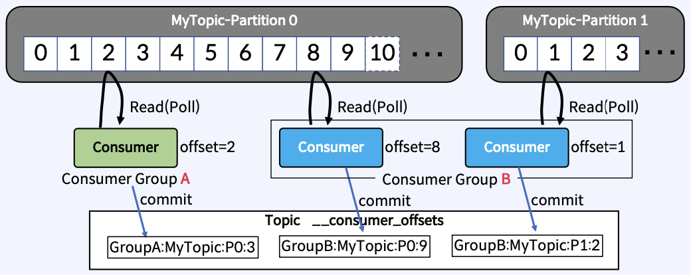

1. Apache Kafka는 무엇인가?
    * 연속적인 event 처리 platform
    * Linked in에서 개발

2. Event란?
    * 비즈니스에서 일어나는 모든 일을 의미

3. Event Stream은 무엇인가?
    * 연속적인 많은 이벤트들의 흐름
    * Event는 비즈니스의 모든 영역에서 광범위하게 발생하고 대용량의 데이터를 발생 시킨다.

4. Apache Kafka의 특징
    * 이벤트 스트림을 안전하게 전송, 처리한다.(publish, subscribe)
    * 이벤트 스트림을 디스크에 저장
    * 이벤트 스트림을 분석 및 처리(processing, analysis)

5. Apache Kafka 사용 사례
    * application에서 발생하는 로그 수집
    * Realtime Event Stream Processing
    * DB 동기화
    * 실시가 ETL
        * ETL이란?
            * 데이터의 추출, 이동 및 변환를 뜻한다.
            * 데이터 스토어, 데이터 웨어하우스, 데이터 마트 등에 데이터를 적재하는 작업의 구성 요소
    * Spart, Flink, Storm, Hadoop 과 같은 빅데이터 기술과 같이 사용

6. Apache Kafka 주요 요소
    * 
    * Topic
        * Kafka cluster에 존재한다.
        * 논리적적으로 Event가 저장되는 저장소
    * Producer
        * Event를 생산하고 Kafka의 Topic으로 보낸다.
    * Consumer
        * Topic의 메시지를 가져와서 소비한다.
    * Consumer Group
        * Topic의 메시지를 사용하기 위해 협력하는 Consumer들의 집합
        * 하나의 Consumer는 하나의 Consumer Group에 포함되며, Consumer Group내의 Consumer들은 협력하여 Topic의 메시지를 분산 병렬 처리

7. Producer와 Consumer의 분리(Decoupling) 동작 방식
    * 
    * Producer와 Consumer는 독립적으로 구성되고 서로 알지 못한다.
    * Producer와 Consumer는 각각 고유의 속도로 Commit Log에 Read(poll), Write 한다.
    * 다른 Consumer Group에 속한 Consumer들은 서로 관련이 없다.
    * Commit Log에 있는 Event를 동시에 다른 위치에서 Read한다.
    * 이미지에서 Group A, B에 있는 Consumer는 서로 관련이 없고 독립적으로 Commit Log를 읽어 데이터를 처리한다.

8. Kafka Commit Log
    * Commit Log
        * 기본적으로 추가만 가능하고 수정은 불가능한 데이터 스트럭쳐
    * Offset
        * Commit Log에서 Event의 위치
    * 
    * write가 되면 Commit Log에 append되면서 offset이 증가한다.
    * offset은 Commit Log안에서 append되는 증가 값

9. Kafka Offset
    * Commit Log에서 Event의 위치
    * Offset은 증가만 하고 0으로 돌아가지 않는다.
    * Offset은 본인이 속한 Partition에서만 의미를 가진다.
        * Partition 0번의 Offset 3은 Partition 1번에서는 아무 의미 없다.
    * Producer가 Commit Log에 write 하는 마지막 위치를 LOG-END-OFFSET이라 한다.
    * Consumer가 read 후 commit한 위치를 CURRENT-OFFSET이라 한다.
    * Consumer가 offset 3번까지 read 후 commit하면 다음에는 offset 4번 부터 read한다.
    * LOG-END-OFFSET과 CURRENT-OFFSET과의 차이를 Consumer Lag이라고 하고 이 차이가 클수록 퍼포먼스를 내지 못한다.

10. Topic, Partition, Segment
    * 
    * 
    * Topic
        * kafka 안에서 메시지가 저장되는 장소, 논리적인 표현
    * Partition
        * Commit Log이다.
        * 하나의 Topic은 하나 이상의 Partition으로 구성되어 병렬처리(Throughtput 향상)를 한다.
        * Partition은 서로 독립적이다.
        * Topic 생성시에 Partition 개수를 지정한다. 후에도 조정은 가능하지만 이슈가 발생할 여지가 있다.
        * Partition은 Broker들에 분산된다.
        * Segment File로 구성된다.
        * 오직 1개의 Segment만 Active 되어 있고 여기에 데이터가 쓰여진다.
    * Segment
        * Event가 저장되는 실제 물리 file
        * Segment file이 지정된 크기보다 크거나 지정된 기간보다 오래되면 새 파일이 열리고 Eent가 추가된다.
        * Segment에는 여러개의 Event가 쌓인다.
        * Rolling Strategy
            * Segment가 새로 생성되는 규칙은 아래 2가지 이고 값은 조정한다.
            * log.segment.bytes(default 1GB)
            * log.roll.hours(default 168 hours)

11. 기타
    * Event의 순서는 하나의 Partition내에서만 보장
    * Partition에 저장된 데이터는 변경이 불가능
    
12. Broker, Zookeeper
    * 
    * Broker
        * Topic과 Partition을 유지 및 관리(read, write)
        * Partition에 대한 Read 및 Write를 관리하는 소프트웨어
        * Kafka Server라고 부르기도 한다.
        * Topic 내의 Partition 들을 분산, 유지 및 관리
        * Broker도 Id로 식별(Id는 숫자)
        * Topic의 일부 Partition들을 포함
            * Partition은 다른 Broker에 분산되기에
        * Kafka Cluster에 여러개의 Broker들로 구성됨
        * Client는 특정 Broker에 연결하면 전체 클러스터에 연결됨
        * 최소 3대 이상의 Broker를 하나의 Cluster로 구성해야 한다.
        * BrokerId와 PartitionId는 아무런 관계가 없다.

13. Bootstrap Servers
    * 모든 Kafka Broker는 Broker Servers를 의미
    * 하나의 Broker에만 연결하면 Cluster 전체에 연견된다. 하지만 연결된 1개의 Broker에 장애가 발생하면 Cluster 전체에 연결이 안되기에 Broker 전체를 연결 한다.
    * 각각의 Broker는 모든 Broker, Topic, Partition에 대해 알고 있다.(Metadata)
    * 

14. Zookeeper
    * Broker를 관리하는 소프트웨어(Broker 목록, 설정)
        * 분산형 Configuration 정보 유지, 분산 동기화 서비스를 제공하고 대용량 분산 시스템을 위한 네이밍 레지스트리를 제공
        * 예시로 Broker, Topic의 수등을 leader가 가지고 있고 follower는 복제본과 leader를 통해 sync하고 broker에 전파한다.
    * Zookeeper는 변경사항에 대해 Kafka에 알림
        * 분산 작업을 제어하기 위해 Tree 형태의 데이터 저장소
        * Topic 생성/제거, Broker 추가/제거 공유, 동기화 수행
    * Zookeeper 없이는 Kafka가 작동할 수 없다.
        * 여담으로 Zookeeper 없이 Kafka 사용할 수 있게 추진중
    * Zookeeper는 홀수의 서버로 작동하게 설계
    * Zookeeper는 하나의 Leader와 나머지 Follower가 있다.
    * 
    * failover
        * Quorum 알고리즘
            * 의사를 진행시키거나 의결 하는데 필요한 최소한도의 인원수를 뜻한다.
            * 분산 코디네이션 환경에서 예상치 못한 장애가 발생해도 분산 시스템의 일관성을 유지시키기 위해서 사용
        * Zookeeper 서버의 클러스터를 Ensemble이라 한다.
    
15. Record(Message) 구조
    * Headers, Key, Value로 구성
        * Headers: Topic, Partition, Timestamp, etc로 Metadata 영역
        * Key, Value는 비지니스 data를 담고 있고 String, Json, Avro등 다양한 형태 가능 Body 영역
        * 

16. Serializer/Deserializer
    * Kafka는 Record를 Byte Array로 저장
    * Producer는 Recode의 body를 json, string, avro 등으로 만들고 send할때 Byte Array로 serializer하고 Kafka는 그대로 저장한다. Consumer는 deserializer하고 비지니스 로직을 처리
    * 

17. Producing to Kafka
    * Producer Application의 내부 아키텍쳐
    * 
        1. application에서 Record를 세팅 후 send call
        2. Serializer 진행(Byte Array)
        3. Partitioner를 통해서 저장될 Partition 조회
        4. Compress는 옵션널이고 압축한다.
        5. RecordAccumulator에 Record를 보낸고 Batch 혹은 건바이 건으로 데이터를 Kafka에 보낸다.
        6. 성공하면 metadata를 리턴한다.
        7. 실패하면 재시도를 통해서 다시 요청한다.
    * Partitioner의 역할
        * Record를 Topic의 어느 Partition으로 보낼지 결정
        * default는 key를 hash화 하고 partition으 갯수로 나누고 나머지에 나오는 값으로 partition을 선택, 조건은 key가 null이 아닌 경우!
        * 
    * Partitioner의 종류
        * Kafka 2.4 버전 이전과 후로 나누어 진다.
        * 2.4 이전 버전
            * key가 null인 경우 round robin으로 동작 했지만 batch mode에서는 batch 사이즈를 모두 채우지 못하는 이슈가 발생
            * 
        * 2.4 이후 버전
            * keyrk null인 경우 Stickey 정책으로 batch가 닫힐 때까지 Record를 쌓고 모두 채워지면 랜덤으로 partition을 선택해 보낸다.
            * 

18. Consumer Offset
    * Consumer가 자동이나 수동으로 데이터를 읽은 위치를 commit하여 다시 읽음을 방지
    * 정확하게 말하면 __consumer_offsets 라는 Internal Topic에서 Consumer Offset을 저장하여 관리
    * 

19. Multi-Partition with Single Consumer
    * 4개의 partition으로 구성된 Topic의 데이터를 사용하는 single Consumer가 있는 경우 consumer는 4개의 partition에서 모든 recored를 consume하고 internal topic에 partition 별로 offset 관리
    * 

20. Consuming as a Group
    * 동일한 group.id로 구성된 consumer는 하나의 Consumer Group을 형성
    * 4개의 partition이 있고 group에 4개의 consumer가 있다면 consumer는 각자 1개의 partition을 consume한다.
    * partition입장
        * partition은 동일한 group에 내의 1개의 consumer만 사용가능
    * consumer 입장
        * 할당한 Topic 내의 0개 이상 partition을 사용
    * 

21. Multi Consumer Group
    * consumer group의 consumer들은 작업량을 어느 정도 균등하게 분할함
    * 동일한 Topic에서 consume하는 여러 Consumer Group이 있을 수 있음
    * 

22. Message Ordering
    * 1개의 Partition은 순서를 보장한다.
    * 하지만 전체 Partition의 순서는 보장 하지 않는다.
    * Partition 저장소는 Record에 있는 key를 통해서 정해진다. 그래서 순서 보장이 필요한 데이터는 key에 동일한 값을 넣어 1개의 Partition에 몰아 주면 key 레벨의 순서 보장은 가능하다
    * 하지만 운영중에 Partition 개수를 변경하면 순서 보장이 불가능하다.!

23. Cardinality
    * 특정 데이터 집합에서 유니크한 값의 개수
    * Key Cardinality는 Consumer Group의 개별 Consumer가 수행하는 작업의 양에 영향을 준다.
        * 2개의 Partition에 'a'라는 Key로 모든 Event를 보내면 1개의 Partition에만 적재된다.
    * Key는 Integer, String 등과 같은 단순한 유형일 필요가 없다.
    * Partition 전체에 Record를 고르게 배포하는게 중요하다.
    * Key도 Value와 같이 Json, Avro 등 여러 필드가 있는 복잡한 객체일 수 있다.

24. Consumer Failure
    * Consumer Group 내의 다른 Consumer가 실패한 Consumer를 대신하여 Partition에서 데이터를 가져와서 처리함
    * 규칙은 동일하다. Partition은 1개의 Consumer만 접근 가능, Consumer는 0개 이상의 Partition 접근 가능
    * 

25. Broker에 장애가 발생하면?
    * Broker에 장애가 발생하면 해당 Partition은 모두 사용할 수 없다.
    * 이런 경우를 대비해서 Replication을 사용한다.

26. Replication of Partition
    * Partition을 복제하여 다른 Broker상에서 복제물을 만들어서 장애를 미리 대비함
    * 사용하기 위해서는 Replication Factor 옵션을 준다.
    * Replicas는 Leader, Follower Partition으로 나뉜다.
    * Producer, Consumer는 Leader에서만 write, read를 하고 Follower는 데이터 복제만 한다.
    * Follower는 Leader의 Commit Log에서 Fetch Request로 복제 한다.
    * 

27. Partition Leader
    * Leader에 장애가 발생하면 Follower 중에서 새로운 Leader를 선출
    * Client(Producer, Consumer)는 변경된 Leader를 본다.
    * 
    * 하나의 Broker에 Leader가 몰리면 특정 Broker에만 부하가 발생
        * Hot Spot을 방지하기 위해 아래와 같은 옵션이 있다.
            * auto.leader.rebalance.enable: default(enable)
                - leader를 여러 broker에 분산
            * leader.imbalance.check.inverval.seconds: default(300sec)
                - leader의 불균형이 있는지 확인
            * leader.imbalance.per.broker.percentage: default(10)
                - 특정 broker에 쌓이는 Event가 10%가 넘는 경우 이상 감지

28. Rack Awareness
    * Rack 간 분산하여 Rack 장애를 대비
    * 1개의 Rack(AZ)에 모든 Broker가 있는경우 Rack에 장애 발생시에 크리티컬 해진다. 이를 방지하기 위해 Broker 같의 Rack Name을 지정한다. 'broker.rack=ap-notheast-2a'
    * Topic 생성, Auto Data Balancer, Self Balancing Cluster 동작 때만 싱행
    * 

29. In-Sync Replicas(ISR)
    * Leader 장애시 Leader를 선출하는데 사용
    * ISR은 High Water Mark 지점까지 동일한 Replicas의 목록
    * Leader에서 장애 발생하면 ISR 중에서 새 Leader를 선출
    * 
    * High Water Mark
        * Follower가 Leader에게 Fetch Request를 날리고 데이터를 복제 후 Commit을 날립니다.
        * 해당 Commit이 replica.lag.max.message의 값 범위에 포함 되면 여기를 High Water Mark라고 한다.
    * replica.lag.max.message
        * high water mark를 판단하는 기준 옵션
    * ISR에 들어가지 못한 Broker들은 OSR(Out-of-Sync Replicas)라고 한다.

30. replica.lag.max.message의 문제점
    * 메시지의 유입량이 갑자기 늘어날 경우 정확히 판단하기 어려운 문제가 있다.
    * 정확한 판단을 하기 위해서는 replica.lag.time.max.ms로 해야 한다.
        * Follower가 Leader로 Fetch 요청을 보내는 interval을 체크해서 ISR을 판간한다.
        * replica.lag.time.max.ms의 시간 안에 Fetch 요청이 있다면 정상으로 판단

31. ISR은 Leader가 관리
    * 
    * Leader가 ISR에서 Follower를 제거하고 Zookeeper에 ISR을 유지
    * Controller는 Partition Metadata에 대한 변경 사항에 대해서 Zookeeper로 부터 수신

32. Controller
    * Kafka Cluster 내의 Broker중 하나가 Controller가 됨
    * Zookeeper를 통해 Broker Liveness를 모니터링
    * Controller가 Leader와 Replica 정보를 Clusteer내의 다른 Broker에 전달
    * Controller는 Zookeeper에 Replicas 정보의 복사본을 유지한 다음 더 빠른 엑세스를 위해 클러스터의 모든 Broker들에 동일한 정보를 캐시함
    * Controller가 Leader 장애시 Leader Election을 수행
    * Controller에 장애 발생시 다른 Active Broker들 중에 재선출

33. Consumer 관련 Position
    * Last Committed Offset(current offset)
        - Consumer가 최종 Commit한 Offset
    * Current Position
        - Consumer가 읽어간 위치(처리 중, commit 전)
    * High Water Mark(committed)
        - ISR간에 복제된 Offset
    * Log End Offset
        - Producer가 메시지를 보내서 저장된 로그의 맨 끝 Offset
    * 

34. Committed
    * ISR 목록의 모든 Repllicas가 메시지를 성공적으로 가져온걸 의미
    * Consumer는 Committed 메시지만 읽을 수 있음
    * Leader는 메시지를 Commit할 시기를 결정
    * Committed 메시지는 모든 Follower에서 동일한 Offset을 갖도록 보장
    * 어떤 Replica가 Leader인지에 관계없이 모든 Consumer는 해당 Offset에서 같은 데이터를 볼 수 있음
    * Broker가 다시 시작할 때 Committed 메시지 목록을 유지하도록 하기 위해, Broker의 모든 Partition에 대한 마지막 Committed Offset은 replication-offset-checkpoint라는 파일에 기록

35. Replicas 동기화
    * High Water Mark
        - 가장 최근에 Committed 메시지의 Offset 추적
        - replication-offset-checkpoint 파일에 체크포인트를 기록
    * Leader Epoch
        - 새 Leader가 선출된 시점을 Offset으로 표기
        - Broker 복구 중에 메시지를 체크포인트로 자른 다음 현재 Leader를 따르기 위ㅣ해 사용
        - Controller가 새 Leader를 선택하면 Leader Epoch를 업데이트하고 해당 정보를 ISR 목록의 모든 구성원에 보냄
        - leader-epoch-checkpoint 파일에 체크포인트를 기록

36. Message Commit 과정
    * Fetch Thread에서 주기적으로 Leader에서 메시지를 동기화 합니다.
    * 
    * 
    * 
    * 
