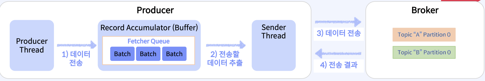
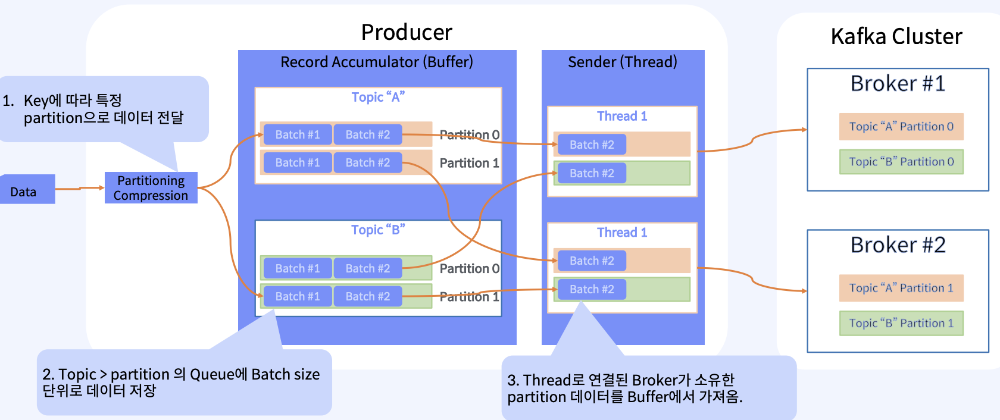
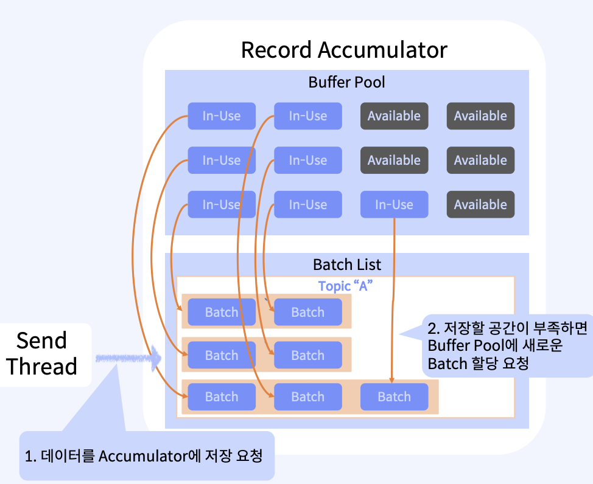
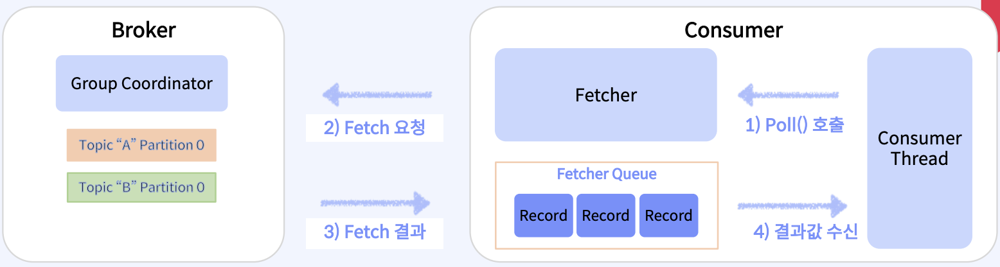

1. 전체 구간별 모니터링 대상
    * Producer
        - 초당 요청 건수/사이즈
        - 처당 전송 사이즈
        - I/O 사용률
    * Broker
        - Active Controller 개수
        - 초당 유입/유출 건수 및 사이즈
        - 평균 처리 시간
        - Topic tkdxo (ISR)
        - Log Flush 비율
        - 비정상 복제본 개수
    * Consumer
        - 초당 읽어온 건수/사이즈
        - 가장 높은 Offset Lag
        - 초당 Commit 한 건수
        - Consumer Group 정보

2. 확인이 필요한 지표
    * 처리 성능
        - 입력/출력 처리량
            -> Broker로 수신/송신 하는 초당 요청 건수와 전송 사이즈
            -> Disk 쓰기 성능은 가능한 높게
        - Lag 상태
            -> 처리되지 못한 메시지 개수는 가능한 적게
    * 서비스 안정성
        - Controller 상태
            -> Active Controller의 개수 >0
            -> Leader Election 실행 비율 >0
        - Topic 관리
            -> 비정상 Partition의 개수
            -> 디스크에 쓰지 못하는 Log 디렉토리 개수
    * 클러스터 확장성
        - 자원 사용률
            -> Network, CPU 등의 자원 사용률 가능한 높게
        - Controller 성능
            -> Active Controller의 요청 건수 / 요청 대기시간 가능한 적게
        - 처리 성능
            -> Queue에 대기 중인 요청 건수 가능한 적게

3. Producer Metric 이해
    * 
    * Buffer 구간
        - 데이터 압축률
            -> compression-rate-avg
                - 압축률 변화 추이
                - 압축률이 갑자기 변한다면, 입력 데이터의 변화 확인
        - I/O 대기 시간 (CPU 대기)
            -> io-wait-time-ns-avg
                - cpu가 i/o 작업이 완료될 때 까지 기다린 평균 시간
        - 가용 Buffer 사이즈
            -> buffer-available-bytes
                - 사용 가능한 buffer memory 크기
                - 여유 공간 확인
        - Buffer 할당 대기 시간
            -> bufferpool-wait-time
                - buffer pool에 데이터를 추가하기 위해 대기한 시간의 비율
                - 비율이 높으면 새로운 buffer 메모리 확장
        - Buffer 할당 대기 thread 수
            -> waiting-treads
                - 데이터를 저장할 Buffer 메모리 할당 받지 못해 대기 중인 thread 개수
                - 수치가 증가하면 Buffer 메모리의 크기가 적절한지 검토 필요
        record-queue-time-avg
            - 전송되기 전에 데이터가 buffer에서 대기한 평균 시간
            - linger.ms 이내로 관측
    * Sender 구간
        - 연결된 connection 관련 정보
            -> connection-count
                - 현재 Broker와 연결된 connection 개수
                - 연결 수의 증감을 변화 확인
        - 인증 실패한 connection 정보
            -> failed-authentication-rate
                - 인증을 적용한 경우, 초당 인증 실패 건수
        - Buffer의 데이터 체크 건수
            -> select-rate
                - sender thread가 buffer에 브로커로 전송할 데이터가 있는지 i/o 체크 한 횟수(초당)
                - 값이 증가하면 전송 가능한 상태의 데이터가 buffer에 없음을 의미
        - 전송 Queue 대기 시간
            -> record-queue-time-avg
                - 전송할 데이터가 buffer에서 대기한 평균 시간
                - 지속 증가하는지 확인
        - 전송 부하로 인한 대기 시간(throuting time)
            -> produce-throttle-time-avg
                - 브로커에 의해 요청을 중지한 평균 시간(ms)
                - 값이 증가하면 브로커에 부하가 크다고 판단해서 브로커를 증설하거나 브로커의 quota를 증가
        - 전송 실패 건수
            -> record-error-rate
                - 초당 전송 실패한 record 건수
                - 가능한 0 유지
        - 재전송 비율
    * 전송 구간
        - Producer / Broker / Topic 별
            -> 초당 평균 전송 요청 건수
                -> record-send-rate
                    - 초당 전송된 record 건수
                    - 수치 증감 확인
            -> 초당 전송 데이터 사이즈
                -> batch-size-avg
                    - 요청 시 partition별 평균 전송크기
                    - batch.size 보다 크다면 batch.size 증가
                -> record-size-avg
                    - 전송된 record의 평균 사이즈
                    - 평균 사이즈 관측을 통해 batch.size 증가 결정
            -> 평균 요청 처리 시간
            -> 초당 평균 record 전송 건수
            -> 초당 평균 record 전송 사이즈
            -> outgoing-byte-rate
                - 초당 전송된 데이터 사이즈
            -> response-rate
                - 초당 브로커에게서 응답을 받은 건수
                - ack 옵션에 따라 응답시간에 차이 발생
                - 급격하게 증가/감소 하는지 확인
            -> request-latency-avg
                - 요청 후에 응답을 받기까지 소요된 평균 시간
                - 메모리가 충분하다면 batch size를 늘려 처리량은 높이고 latency는 유지
            -> request-size-avg
                - 요청시 전송되는 데이터 평균 사이즈
    * 
        - 데이터 압축률
        - Buffer 사이즈 및 사용률
        - I/O 대기로 인한 CPU 유휴 시간
        - connection 및 인증 정보
        - 전송 성능(요청 빈도, 전송 크기)
        - 전송 소요 시간
        - 전송 실패 건수
        - 평균 배치 크기, 평균 record 크기
        - 평균 전송 record 건수

4. Buffer Pool 관련 내부 구조
    * 
    * Buffer Pool에 가용한 메모리가 없다면?
        - RecordAccumulator는 이후 요청은 차단하고, 메모리가 확보될 때까지 대기
        - Send Thread는 역시 Batch 공간을 할당 받기 위하여 대기(waiting-thread 증가)
        - Bufferpool_wait_time은 이렇게 send thread가 대기한 비율을 나타낸다.
    * Buffer Pool에 가용 메모리가 부족한 이유
        - Producer가 전송할 데이터를 읽어오는 속도가 너무 빨라서, buffer pool의 메모리가 확보되지 못하는 경우
        - 이로인해 send thread가 계속 대기하게 되고, 결국 전송 성능 저하

5. Consumer Metric 이해
    * 
    * Coordinator 구간
        - 초당 heart beat 요청 건수
        - 초당 group join 건수
        - 초당 group sync 건수
        - rebalance 편균 소요 시간
        - 시간당 rebalance 성공/실패 건수
    * consumer 전송 구간
        - consumer / topic / partition
        - 초당 fetch 요청 건수
        - 초당 record/byte 건수
        - quota 제약으로 대기 시간
        - 평균 commit 요청 처리 시간
        - 초당 commit 요청 건수
        - partition 별 lag 개수
        - fetch-latency-avg 
            - fetch 요청에 소요되는 평균 시간
        - fetch-rate
            - 초당 fetch 요청 건수
            - 증감 뼌화 확인
        - fetch-throttle-time-avg
            - quota를 초과하여 broker 요청에 따라 대기한 시간
            - 값이 증가시 quota 확장
        - bytes-consumed-rate
            - 초당 읽어온 byte 사이즈
        - fetch-size-avg
            - 한번의 요청에 가져온 평균 byte 사이즈
            - 너무 작은지 확인
        - records-consumed-rate
            - 초당 가져온 레코드 평균 수
            - fetch-size-avg와 같이 확인이 필요하다.
        - records-per-request-avg
            - 한 번의 요청에 가져온 평균 레코드 수
    * consumer 내부 구간
        - poll 함수 호출 평균 delay
            -> time-between-poll-avg
                - poll 함수를 다시 호출하기 까지 소요 시간
                - 값이 증가시 group에서 제외 될 수 있음
            -> last-poll-secneds-ago
                - 마지막 poll을 호출한 이후 지난 시간
                - 값이 증가시 group에서 제외 될 수 있음
        - poll 호출되지 않은 평균 시간
            -> poll-idel-ratio-avg
                - poll이 호출되지 않은 시간 비율
                - 값이 증가하면 조치 필요, 가져오는 데이터를 줄이는 등